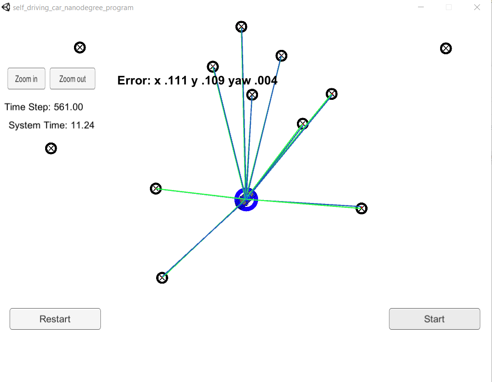

# Kidnapped Vehicle

## _A project of Self-Driving Car Engineer Nanodegree_

[](http://www.udacity.com/drive)  

### The goals of this project are the following:

* Build an end-to-end localizer using 2D [Particle Filter](https://en.wikipedia.org/wiki/Monte_Carlo_localization) for sparse localization
* Track a moving car based on it's LIDAR measurements from a sparse feature map
* Meet the required processing time budget and error rate

---

### Particle Filter

Monte Carlo Localization (MCL) is also referred to as Particle Filter Localization. It uses a collection of particles to represent discrete guesses where the robot might be.

The essence of Particle Filter is to have these particles guess where the robot might be moving, but also have them survive using effectively survival of the fittest so that particles that are more consistent with the measurements are more likely to survive and as a result places of high probability will collect more particles, and therefore be more representative of the robot's posterior belief.

### Localization Pipeline

1. initialization with best estimates, such as GPS measurement
2. for each particle, predict its states based on motion model, such as bicycle model, by adding control inputs
3. for each particle, update its weight using map landmark positions and feature measurement, coordinate transformation need to be preformed at this step
4. resampling by drawing particles proportional to its weight
5. this new set of particles represent a refined estimate of the vehicle position

### Build the Pipeline

The pipeline has been tested in WSL using Ubuntu 18.04.

```sh
# prepare build environment
./install-ubuntu.sh

# build pipeline
./build.sh

# run pipeline
./run.sh
```

### Demo Run

A run screen is shown in below:



- blue car - ground truth data
- blue circle, with arrow point to the heading of the car - estimated location
- green line - laser range reading from the car
- blue line - laser range reading from the particle

Notice that the green laser sensors from the car nearly overlap the blue laser sensors from the particle, this means that the particle transition calculations were done correctly.

Here is a video recording to show how the particle filter pipeline work in simulator.

[](https://youtu.be/0gnI4elrmuk)  

As shown in the above recording, the localizer successfully localized the moving car in the feature map.
- The RMSE for x, y positions is reaching 0.116; while the RMSE for yaw is able to reach 0.004
- The LIDAR is running at 10Hz for this project. The pipeline took less than 49 seconds to process 2443 readings (244 seconds worth of data)
